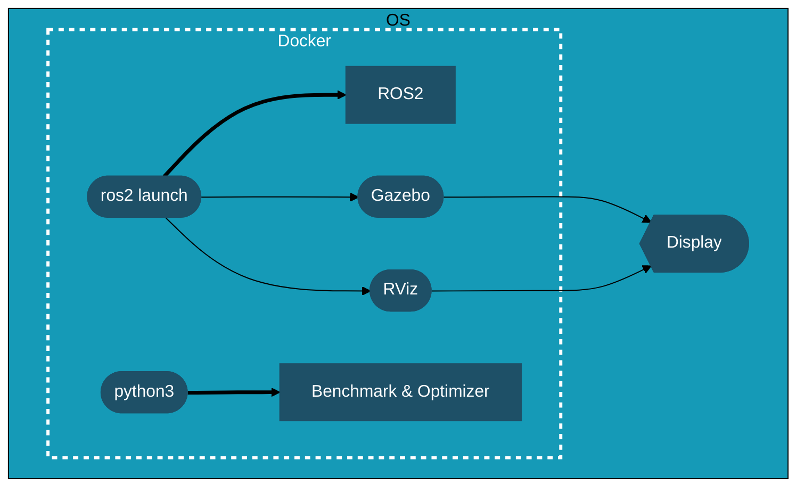

## color codes:
- white: #fff
https://mermaid.js.org/syntax/flowchart.html
https://mermaid.js.org/config/theming.html#flowchart-variables
packages/button
├── lib
│   ├── button.d.ts
│   ├── index.js
│   └── index.js.map
├── package.json
│   └── index.ts
└── tsconfig.json

```mermaid
flowchart TD
    roslogoA@{ img: "https://www.freshconsulting.com/wp-content/uploads/2022/07/ROS-2_logo.png", label: "Image Label", pos: "t", w: 60, h: 60, constraint: "off" }
```

