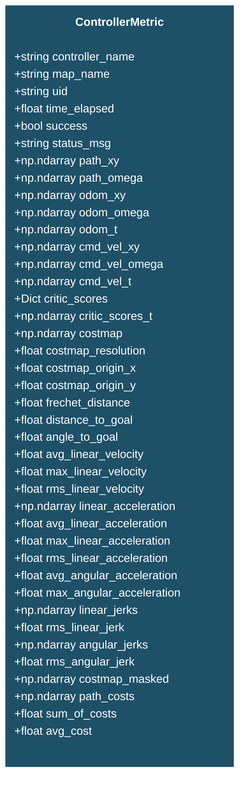

```mermaid
%%{
    init: {
        'securityLevel': 'loose',
        'theme': 'base',
        'themeVariables': {
            'darkMode':'false',
            'background':'#fff',
            'primaryColor':'#1e5067',
            'primaryBorderColor':'#1e5067',
            'primaryTextColor': '#fff',
            'secondaryColor':'#6BB6C7',
            'tertiaryColor':'#fff',
            'tertiaryBorderColor':'#000000',
            'clusterBkg':'#159ab7'
        }
    }
}%%

classDiagram
    class ControllerMetric {
        +string controller_name
        +string map_name
        +string uid
        +float time_elapsed
        +bool success
        +string status_msg
        +np.ndarray path_xy
        +np.ndarray path_omega
        +np.ndarray odom_xy
        +np.ndarray odom_omega
        +np.ndarray odom_t
        +np.ndarray cmd_vel_xy
        +np.ndarray cmd_vel_omega
        +np.ndarray cmd_vel_t
        +Dict critic_scores
        +np.ndarray critic_scores_t
        +np.ndarray costmap
        +float costmap_resolution
        +float costmap_origin_x
        +float costmap_origin_y
        +float frechet_distance
        +float distance_to_goal
        +float angle_to_goal
        +float avg_linear_velocity
        +float max_linear_velocity
        +float rms_linear_velocity
        +np.ndarray linear_acceleration
        +float avg_linear_acceleration
        +float max_linear_acceleration
        +float rms_linear_acceleration
        +float avg_angular_acceleration
        +float max_angular_acceleration
        +np.ndarray linear_jerks
        +float rms_linear_jerk
        +np.ndarray angular_jerks
        +float rms_angular_jerk
        +np.ndarray costmap_masked
        +np.ndarray path_costs
        +float sum_of_costs
        +float avg_cost
    }

```